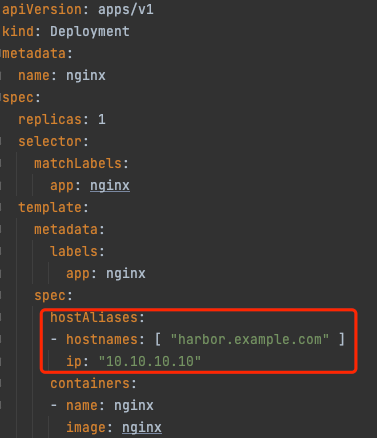

# 自定义域名解析

本文介绍在 kubernetes 上如何自定义集群 CoreDNS 的域名解析。

## 添加全局自定义域名解析

可以为 coredns 配置 hosts 来实现为 kubernetes 集群添加全局的自定义域名解析:

编辑 coredns 配置:

```bash
kubectl -n kube-system edit configmap coredns
```

加入 hosts:

```txt
            hosts {
                10.10.10.10 harbor.example.com
                10.10.10.11 grafana.example.com
                fallthrough
            }
```


> 参考 [CoreDNS hosts 插件说明](https://coredns.io/plugins/hosts/)

如果是想解析到集群内的 Service，也可以配置下 rewrite:

```txt
            rewrite name harbor.example.com harbor.harbor.svc.cluster.local
```


> 参考 [CoreDNS rewrite 插件说明](https://coredns.io/plugins/rewrite/)

## 为部分 Pod 添加自定义域名解析

如果有部分 Pod 对特定的域名解析有依赖，在不希望配置 dns 解析的情况下，可以使用 K8S 提供的 `hostAliases` 来为部分工作负载添加 hosts:

```yaml
    spec:
      hostAliases:
      - hostnames: [ "harbor.example.com" ]
        ip: "10.10.10.10"
```



添加后在容器内可以看到 hosts 被添加到了 `/etc/hosts` 中:

```bash
$ cat /etc/hosts
...
# Entries added by HostAliases.
10.10.10.10	harboar.example.com
```