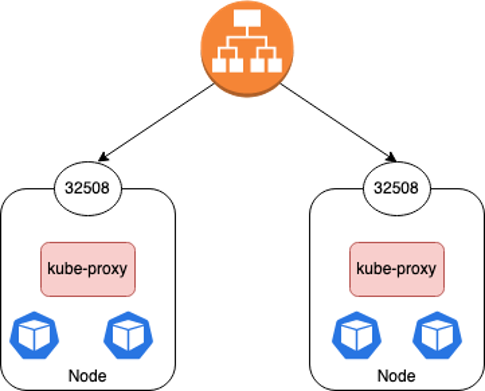
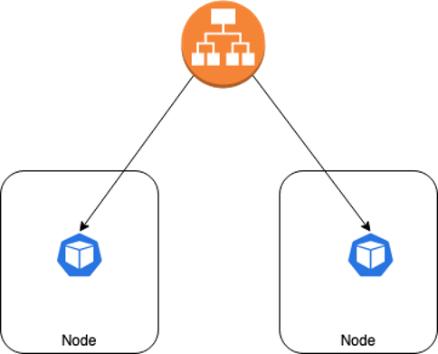

# LB 直通 Pod 场景

## 传统 NodePort 场景

K8S 服务对外暴露传统方案是 LB 绑定 Service 的 NodePort 流量从 LB 打到 NodePort 之后再由 kube-proxy 生成的 ipvs 或 iptables 规则进行转发:



这样当滚动更新时，LB 绑定的 NodePort 一般无需变动，也就不需要担心 LB 解绑导致对业务有损。

## LB 直通 Pod 场景

现在很多云厂商也都支持了 LB 直通 Pod，即 LB 直接将流量转发给 Pod，不需要再经过集群内做一次转发:



当滚动更新时，LB 就需要解绑旧 Pod，绑定新 Pod，如果 LB 到旧 Pod 上的存量连接的存量请求还没处理完，直接解绑的话就可能造成请求异常；我们期望的是，等待存量请求处理完，LB 才真正解绑旧 Pod。

## 解决方案

### TKE

腾讯云 TKE 官方针对四层 Service 和七层 Ingress 都提供了解决方案。

如果是四层 Service，在 Service 上加上这样的注解即可(前提是 Service 用了 CLB 直通 Pod 模式):

```yaml
service.cloud.tencent.com/enable-grace-shutdown: "true"
```

> 参考官方文档 [Service 优雅停机](https://cloud.tencent.com/document/product/457/60064)

如果是七层 CLB 类型 Ingress，在 Ingress 上加上这样的注解即可(前提是 Service 用了 CLB 直通 Pod 模式):

```yaml
ingress.cloud.tencent.com/enable-grace-shutdown: "true"
```

> 参考官方文档 [Ingress 优雅停机](https://cloud.tencent.com/document/product/457/60065)

### ACK

阿里云 ACK 目前只针对四层 Service 提供了解决方案，通过注解开启优雅中断与设置中断超时时间:

```yaml
service.beta.kubernetes.io/alibaba-cloud-loadbalancer-connection-drain: "on"
service.beta.kubernetes.io/alibaba-cloud-loadbalancer-connection-drain-timeout: "900"
```

> 参考官方文档 [通过Annotation配置负载均衡](https://help.aliyun.com/document_detail/86531.html)