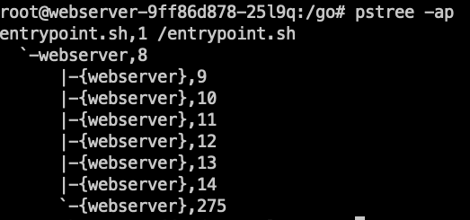

# 为什么收不到 SIGTERM 信号？

我们的业务代码通常会捕捉 `SIGTERM` 信号，然后执行停止逻辑以实现优雅终止。在 Kubernetes 环境中，业务发版时经常会对 workload 进行滚动更新，当旧版本 Pod 被删除时，K8S 会对 Pod 中各个容器中的主进程发送 `SIGTERM` 信号，当达到超时时间进程还未完全停止的话，K8S 就会发送 `SIGKILL` 信号将其强制杀死。

业务在 Kubernetes 环境中实际运行时，有时候可能会发现在滚动更新时，我们业务的优雅终止逻辑并没有被执行，现象是在等了较长时间后，业务进程直接被 `SIGKILL` 强制杀死了。

## 什么原因?

通常都是因为容器启动入口使用了 shell，比如使用了类似 `/bin/sh -c my-app` 这样的启动入口。 或者使用 `/entrypoint.sh` 这样的脚本文件作为入口，在脚本中再启动业务进程:

这就可能就会导致容器内的业务进程收不到 `SIGTERM` 信号，原因是:

1. 容器主进程是 shell，业务进程是在 shell 中启动的，成为了 shell 进程的子进程。

    
2. shell 进程默认不会处理 `SIGTERM` 信号，自己不会退出，也不会将信号传递给子进程，导致业务进程不会触发停止逻辑。
3. 当等到 K8S 优雅停止超时时间 (`terminationGracePeriodSeconds`，默认 30s)，发送 `SIGKILL` 强制杀死 shell 及其子进程。

## 如何解决?

1. 如果可以的话，尽量不使用 shell 启动业务进程。
2. 如果一定要通过 shell 启动，比如在启动前需要用 shell 进程一些判断和处理，或者需要启动多个进程，那么就需要在 shell 中传递下 SIGTERM 信号了，解决方案请参考 [在 SHELL 中传递信号](propagating-signals-in-shell.md) 。