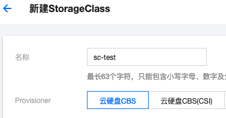
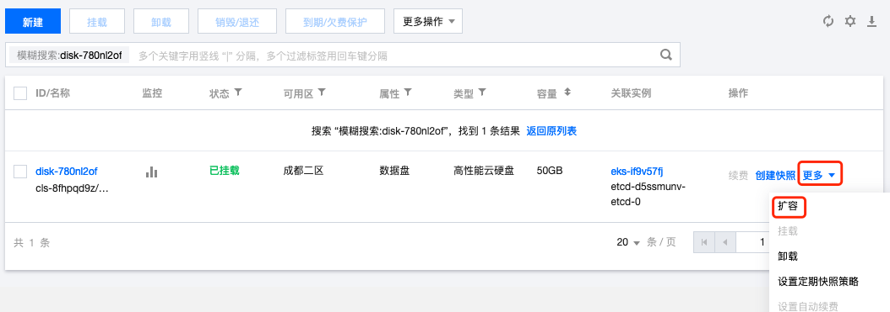
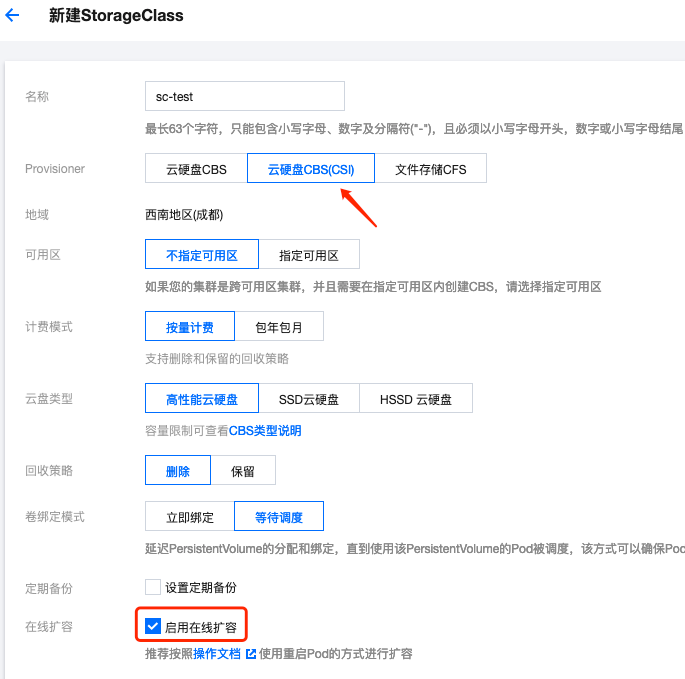
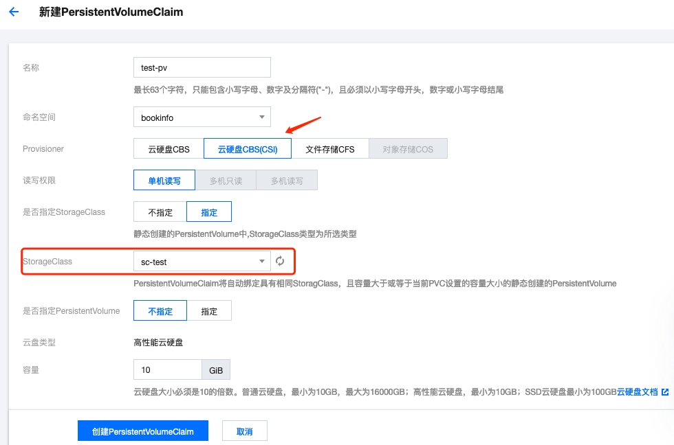
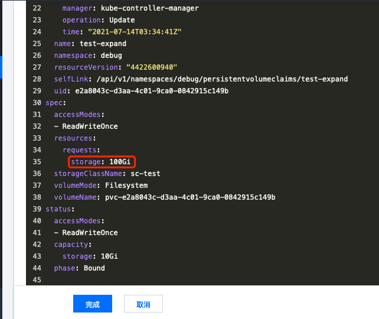

# 扩容 CBS 类型的 PVC

## 概述

TKE 中一般使用 PVC 来声明存储容量和类型，自动绑定 PV 并挂载到 Pod，通常都使用 CBS (云硬盘) 存储。当 CBS 的磁盘容量不够用了，如何进行扩容呢？分两种情况，本文会详细介绍。

## 存储插件类型

CBS 存储插件在 TKE 中存在两种形式:
1. In-Tree: Kubernetes 早期只支持以 In-Tree 的方式扩展存储插件，也就是将插件的逻辑编译进 Kubernetes 的组件中，也是 TKE 集群 1.20 版本之前默认自带的存储插件。
2. CSI: Kubernetes 社区发展过程中，引入存储扩展卷的 API，将存储插件实现逻辑从 Kubernetes 代码库中剥离出去，各个存储插件的实现单独维护和部署，无需侵入 Kubernetes 自身组件，也是社区现在推荐的存储扩展方式。TKE 在 1.20 版本之前，如果要使用 CSI 插件，可以在扩展组件中安装 CBS CSI 插件；自 1.20 版本开始，默认安装 CBS CSI 插件，将 In-Tree 插件完全下掉。

可以检查 PVC 对应 StorageClass 的 yaml，如果 provisioner 是 `cloud.tencent.com/qcloud-cbs`，说明是 In-tree，如果是 `com.tencent.cloud.csi.cbs` 就是 CSI。

## In-Tree 插件扩容 PVC

如何符合以下两种情况，说明你的 CBS PVC 用的 In-Tree 插件:
1. 如果你的集群版本低于 1.20，并且没有安装 CSI 插件 (默认没有安装)，那么你使用的 CBS 类型 PVC 一定用的 In-Tree 插件；
2. 如果安装了 CSI 插件，但创建的 PVC 引用的 StorageClass 并没有使用 CSI (如下图)。



对 In-Tree 插件的 PVC 进行扩容需要手动操作，比较麻烦，操作步骤如下:

1. 获取 pvc 所绑定的 pv:
```bash
$ kubectl -n monitoring get pvc grafana -o jsonpath='{.spec.volumeName}'
grafana
```

2. 获取 pv 对应的 cbs id:
```bash
$ kubectl get pv -o jsonpath="{.spec.qcloudCbs.cbsDiskId}" grafana
disk-780nl2of
```

3. 在[云硬盘控制台](https://console.cloud.tencent.com/cvm/cbs/index) 找到对应云盘，进⾏扩容操作:



4. 登录 CBS 挂载的节点 (pod 所在节点)，找到这块 cbs 盘对应的设备路径:
```bash
$ ls -l /dev/disk/by-id/*disk-780nl2of*
lrwxrwxrwx 1 root root 9 Jul 18 23:26 /dev/disk/by-id/virtio-disk-780nl2of -> ../../vdc
```

5. 执⾏命令扩容⽂件系统(替换 cbs 设备路径):

```bash
# 对于 ext4 ⽂件系统(通常是这种)
resize2fs /dev/vdc
# 对于 xfs ⽂件系统
xfs_growfs /dev/vdc
```

### FAQ

**不需要改 PVC 或 PV 吗？**

不需要，PVC 和 PV 的容量显示也还是会显示扩容之前的⼤⼩，但实际⼤⼩是扩容后的。

## CSI 插件扩容 PVC

如果 TKE 集群版本在 1.20 及其以上版本，一定是用的 CSI 插件；如果低于 1.20，安装了 CBS CSI 扩展组件，且 PVC 引用的 StorageClass 是 CBS CSI 类型的，开启了在线扩容能力，那么就可以直接修改 PVC 容量实现自动扩容 PV 的容量。

所以 CBS CSI 插件扩容 PVC 过于简单，只有修改 PVC 容量一个步骤，这里就先讲下如何确保 PVC 能够在线扩容。

如果用控制台创建 StorageClass ，确保勾选 【启用在线扩容】（默认就会勾选）:



如果使用 YAML 创建，确保将 `allowVolumeExpansion` 设为 true:

```yaml
allowVolumeExpansion: true # 这里是关键
apiVersion: storage.k8s.io/v1
kind: StorageClass
metadata:
  name: cbs-csi-expand
parameters:
  diskType: CLOUD_PREMIUM
provisioner: com.tencent.cloud.csi.cbs
reclaimPolicy: Delete
volumeBindingMode: WaitForFirstConsumer
```

创建 PVC 时记得选择 CBS CSI 类型且开启了在线扩容的 StorageClass:



然后当需要扩容 PVC 的时候，直接修改 PVC 的容量即可：



> 修改完后对应的 CBS 磁盘容量会自动扩容到指定大小 (注意必须是 10Gi 的倍数)，可以自行到云硬盘控制台确认。

### FAQ

**需要重启 Pod 吗?**

可以不重启 pod 直接扩容，但，这种情况下被扩容的云盘的文件系统被 mount 在节点上，如果有频繁 I/O 的话，有可能会出现文件系统扩容错误。为了确保文件系统的稳定性，还是推荐先让云盘文件系统处于未 mount 情况下进行扩容，可以将 Pod 副本调为 0 或修改 PV 打上非法的 zone (`kubectl label pv pvc-xxx failure-domain.beta.kubernetes.io/zone=nozone`) 让 Pod 重建后 Pending，然后再修改 PVC 容量进行在线扩容，最后再恢复 Pod Running 以挂载扩容后的磁盘。

**担心扩容导致数据出问题，如何兜底?**

可以在扩容前使用快照来备份数据，避免扩容失败导致数据丢失。

