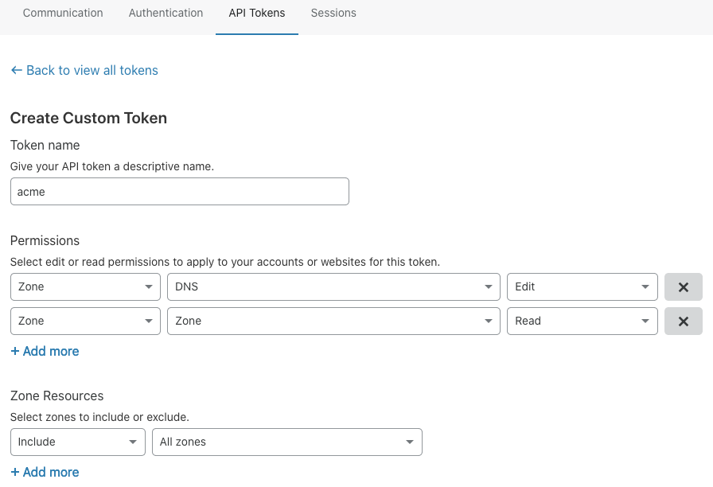

# 使用 cert-manager 签发免费证书

随着 HTTPS 不断普及，越来越多的网站都在从 HTTP 升级到 HTTPS，使用 HTTPS 就需要向权威机构申请证书，需要付出一定的成本，如果需求数量多，也是一笔不小的开支。cert-manager 是 Kubernetes 上的全能证书管理工具，如果对安全级别和证书功能要求不高，可以利用 cert-manager 基于 [ACME](https://tools.ietf.org/html/rfc8555X) 协议与 [Let's Encrypt](https://letsencrypt.org/) 来签发免费证书并自动续期，实现永久免费使用证书。

## cert-manager 工作原理

cert-manager 部署到 Kubernetes 集群后，它会 watch 它所支持的 CRD 资源，我们通过创建 CRD 资源来指示 cert-manager 为我们签发证书并自动续期:


解释下几个关键的资源:

* Issuer/ClusterIssuer: 用于指示 cert-manager 用什么方式签发证书，本文主要讲解签发免费证书的 ACME 方式。ClusterIssuer 与 Issuer 的唯一区别就是 Issuer 只能用来签发自己所在 namespace 下的证书，ClusterIssuer 可以签发任意 namespace 下的证书。
* Certificate: 用于告诉 cert-manager 我们想要什么域名的证书以及签发证书所需要的一些配置，包括对 Issuer/ClusterIssuer 的引用。

## 免费证书签发原理

Let’s Encrypt 利用 ACME 协议来校验域名是否真的属于你，校验成功后就可以自动颁发免费证书，证书有效期只有 90 天，在到期前需要再校验一次来实现续期，幸运的是 cert-manager 可以自动续期，这样就可以使用永久免费的证书了。如何校验这个域名是否属于你呢？主流的两种校验方式是 HTTP-01 和 DNS-01，详细校验原理可参考 [Let's Encrypt 的运作方式](https://letsencrypt.org/zh-cn/how-it-works/)，下面将简单描述下。

### HTTP-01 校验原理

HTTP-01 的校验原理是给你域名指向的 HTTP 服务增加一个临时 location ，Let’s Encrypt  会发送 http 请求到 `http://<YOUR_DOMAIN>/.well-known/acme-challenge/<TOKEN>`，`YOUR_DOMAIN` 就是被校验的域名，`TOKEN` 是 ACME 协议的客户端负责放置的文件，在这里 ACME 客户端就是 cert-manager，它通过修改或创建 Ingress 规则来增加这个临时校验路径并指向提供 `TOKEN` 的服务。Let’s Encrypt 会对比 `TOKEN` 是否符合预期，校验成功后就会颁发证书。此方法仅适用于给使用 Ingress 暴露流量的服务颁发证书，并且不支持泛域名证书。

### DNS-01 校验原理

DNS-01 的校验原理是利用 DNS 提供商的 API Key 拿到你的 DNS 控制权限， 在 Let’s Encrypt 为 ACME 客户端提供令牌后，ACME 客户端 \(cert-manager\) 将创建从该令牌和您的帐户密钥派生的 TXT 记录，并将该记录放在 `_acme-challenge.<YOUR_DOMAIN>`。 然后 Let’s Encrypt 将向 DNS 系统查询该记录，如果找到匹配项，就可以颁发证书。此方法不需要你的服务使用 Ingress，并且支持泛域名证书。

## 校验方式对比

HTTP-01 的校验方式的优点是: 配置简单通用，不管使用哪个 DNS 提供商都可以使用相同的配置方法；缺点是：需要依赖 Ingress，如果你的服务不是用 Ingress 暴露流量的就不适用，而且不支持泛域名证书。

DNS-01 的校验方式的优点是没有 HTTP-01 校验方式缺点，不依赖 Ingress，也支持泛域名；缺点就是不同 DNS 提供商的配置方式不一样，而且 DNS 提供商有很多，cert-manager 的 Issuer 不可能每个都去支持，不过有一些可以通过部署实现了 cert-manager 的 [Webhook](https://cert-manager.io/docs/concepts/webhook/) 的服务来扩展 Issuer 进行支持，比如 DNSPod 和 阿里 DNS，详细 Webhook 列表请参考: https://cert-manager.io/docs/configuration/acme/dns01/#webhook

选择哪种方式呢？条件允许的话，建议是尽量用 `DNS-01` 的方式，限制更少，功能更全。

## 操作步骤

### 安装 cert-manager

通常直接使用 yaml 方式一键安装 cert-manager 到集群，参考官网文档 [Installing with regular manifests](https://cert-manager.io/docs/installation/kubernetes/#installing-with-regular-manifests) 。

### 配置 DNS

登录你的 DNS 提供商后台，配置域名的 DNS A 记录，指向你需要证书的后端服务对外暴露的 IP 地址，以 cloudflare 为例:


### HTTP-01 校验方式签发证书

如果使用 HTTP-01 的校验方式，需要用到 Ingress 来配合校验。cert-manager 会通过自动修改 Ingress 规则或自动新增 Ingress 两种方式之一来实现对外暴露校验所需的临时 HTTP 路径，这个就是在给 Issuer 配置 http01 校验，指定 Ingress 的 `name` 或 `class` 的区别 (见下面的示例)。

```yaml
apiVersion: cert-manager.io/v1
kind: Issuer
metadata:
  name: letsencrypt-http01
  namespace: prod
spec:
  acme:
    server: https://acme-v02.api.letsencrypt.org/directory
    privateKeySecretRef:
      name: letsencrypt-http01-account-key
    solvers:
    - http01:
       ingress:
         name: web # 指定被自动修改的 Ingress 名称
```

使用上面的 Issuer 签发证书，cert-manager 会自动修改 `prod/web` 这个 Ingress 资源，以暴露校验所需的临时路径，这是自动修改 Ingress 的方式，你也可以使用自动新增 Ingress 的 方式，示例:

```yaml
apiVersion: cert-manager.io/v1
kind: Issuer
metadata:
  name: letsencrypt-http01
  namespace: prod
spec:
  acme:
    server: https://acme-v02.api.letsencrypt.org/directory
    privateKeySecretRef:
      name: letsencrypt-http01-account-key
    solvers:
    - http01:
       ingress:
         class: nginx # 指定自动创建的 Ingress 的 ingress class
```

使用上面的 Issuer 签发证书，cert-manager 会自动创建 Ingress 资源，以暴露校验所需的临时路径。

有了 Issuer，接下来就可以创建 Certificate 并引用 Issuer 进行签发了，示例:

```yaml
apiVersion: cert-manager.io/v1
kind: Certificate
metadata:
  name: test-mydomain-com
  namespace: prod
spec:
  dnsNames:
  - test.mydomain.com # 要签发证书的域名
  issuerRef:
    kind: Issuer
    name: letsencrypt-http01 # 引用 Issuer，指示采用 http01 方式进行校验
  secretName: test-mydomain-com-tls # 最终签发出来的证书会保存在这个 Secret 里面
```

### DNS-01 校验方式签发证书

如果使用 DNS-01 的校验方式，就需要看你使用的哪个 DNS 提供商了，cert-manager 内置了一些 DNS 提供商的支持，详细列表和用法请参考 [Supported DNS01 providers](https://cert-manager.io/docs/configuration/acme/dns01/#supported-dns01-providers)，不过 cert-manager 不可能去支持所有的 DNS 提供商，如果没有你所使用的 DNS 提供商怎么办呢？有两种方案:

* 方案一：设置 Custom Nameserver。在你的 DNS 提供商后台设置 custom nameserver，指向像 cloudflare 这种可以管理其它 DNS 提供商域名的 nameserver 地址，具体地址可登录 cloudflare 后台查看:

  

  下面是 namecheap 设置 custom nameserver 的示例:

  

  最后配置 Issuer 指定 DNS-01 验证时，加上 cloudflare 的一些信息即可(见下文示例)。

* 方案二：使用 Webhook。使用 cert-manager 的 Webhook 来扩展 cert-manager 的 DNS-01 验证所支持的 DNS 提供商，已经有许多第三方实现，包括国内常用的 DNSPod 与阿里 DNS，详细列表参考: [Webhook](https://cert-manager.io/docs/configuration/acme/dns01/#webhook)。

下面以 cloudflare 为例来签发证书：

1. 登录 cloudflare，点到 `My Profile > API Tokens > Create Token` 来创建 Token:

   

   复制 Token 并妥善保管:

   

   将 Token 保存到 Secret 中:

   ```yaml
   apiVersion: v1
   kind: Secret
   metadata:
     name: cloudflare-api-token-secret
     namespace: cert-manager
   type: Opaque
   stringData:
     api-token: <API Token> # 粘贴 Token 到这里，不需要 base64 加密。
   ```

   > 如果是要创建 ClusterIssuer，Secret 需要创建在 cert-manager 所在命名空间中，如果是 Issuer，那就创建在 Issuer 所在命名空间中。

   创建 ClusterIssuer:

   ```yaml
   apiVersion: cert-manager.io/v1
   kind: ClusterIssuer
   metadata:
     name: letsencrypt-dns01
   spec:
     acme:
       privateKeySecretRef:
         name: letsencrypt-dns01
       server: https://acme-v02.api.letsencrypt.org/directory
       solvers:
       - dns01:
           cloudflare:
             email: my-cloudflare-acc@example.com # 替换成你的 cloudflare 邮箱账号，API Token 方式认证非必需，API Keys 认证是必需
             apiTokenSecretRef:
               key: api-token
               name: cloudflare-api-token-secret # 引用保存 cloudflare 认证信息的 Secret
   ```

   创建 Certificate:

   ```yaml
   apiVersion: cert-manager.io/v1
   kind: Certificate
   metadata:
     name: test-mydomain-com
     namespace: default
   spec:
     dnsNames:
     - test.mydomain.com # 要签发证书的域名
     issuerRef:
       kind: ClusterIssuer
       name: letsencrypt-dns01 # 引用 ClusterIssuer，指示采用 dns01 方式进行校验
     secretName: test-mydomain-com-tls # 最终签发出来的证书会保存在这个 Secret 里面
   ```

### 获取和使用证书

创建好 Certificate 后，等一小会儿，我们可以 kubectl 查看是否签发成功:

```bash
$ kubectl get certificate -n prod
NAME                READY   SECRET                  AGE
test-mydomain-com   True    test-mydomain-com-tls   1m
```

如果 `READY` 为  `False` 表示失败，可以通过 describe 查看 event 来排查失败原因:

```bash
$ kubectl describe certificate test-mydomain-com -n prod
```

如果为 `True` 表示签发成功，证书就保存在我们所指定的 Secret 中 (上面的例子是 `default/test-mydomain-com-tls`)，可以通过 kubectl 查看:

```bash
$ kubectl get secret test-mydomain-com-tls -n default
...
data:
  tls.crt: <cert>
  tls.key: <private key>
```

其中 `tls.crt` 就是证书，`tls.key` 是密钥。

你可以将它们挂载到你需要证书的应用中，或者使用 Ingress，可以直接在 Ingress 中引用 secret，示例:

```yaml
apiVersion: networking.k8s.io/v1beta1
kind: Ingress
metadata:
  name: test-ingress
  annotations:
    kubernetes.io/Ingress.class: nginx
spec:
  rules:
  - host: test.mydomain.com
    http:
      paths:
      - path: /web
        backend:
          serviceName: web
          servicePort: 80
  tls:
    hosts:
    - test.mydomain.com
    secretName: test-mydomain-com-tls
```

## 参考资料

* [cert-manager 官网](https://cert-manager.io/)
* [Let's Encrypt 的运作方式](https://letsencrypt.org/zh-cn/how-it-works/)
* [Issuer API 文档](https://cert-manager.io/docs/reference/api-docs/#cert-manager.io/v1.Issuer)
* [Certificate API 文档](https://cert-manager.io/docs/reference/api-docs/#cert-manager.io/v1.Certificate)
