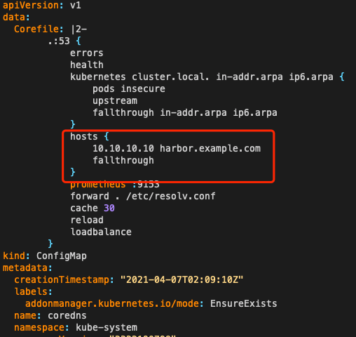

# 多容器场景下修改 hosts 失效

## 问题现象

业务容器启动的逻辑中，修改了 `/etc/hosts` 文件，当 Pod 只存在这一个业务容器时，文件可以修改成功，但存在多个时 (比如注入了 istio 的 sidecar)，修改可能会失效。

## 分析

1. 容器中的 `/etc/hosts` 是由 kubelet 生成并挂载到 Pod 中所有容器，如果 Pod 有多个容器，它们挂载的 `/etc/hosts` 文件都对应宿主机上同一个文件，路径通常为 `/var/lib/kubelet/pods/<pod-uid>/etc-hosts`。
    > 如果是 docker 运行时，可以通过 `docker inspect <container-id> -f {{.HostsPath}}` 查看。

2. kubelet 在启动容器时，都会走如下的调用链（`makeMounts->makeHostsMount->ensureHostsFile`）来给容器挂载 `/etc/hosts`，而在 `ensureHostsFile` 函数中都会重新创建一个新的 `etc-hosts` 文件，导致在其他容器中对 `/etc/hosts` 文件做的任何修改都被还原了。

所以，当 Pod 中存在多个容器时，容器内修改 `/etc/hosts` 的操作可能会被覆盖回去。

## 解决方案

通常不推荐在容器内修改 `/etc/hosts`，应该采用更云原生的做法，参考 [自定义域名解析](../../../best-practices/dns/customize-dns-resolution.md)。

### 使用 HostAliases

如果只是某一个 workload 需要 hosts，可以用 HostAliases:

```yaml
apiVersion: apps/v1
kind: Deployment
metadata:
   name: host
spec:
   replicas: 1
   selector:
      matchLabels:
         app: host
   template:
      metadata:
         labels:
            app: host
      spec:
         hostAliases: # 这下面定义 hosts
         - ip: "10.10.10.10"
           hostnames:
           - "mysql.example.com"
         containers:
         - name: nginx
           image: nginx:latest
```

> 参考官方文档 [Adding entries to Pod /etc/hosts with HostAliases](https://kubernetes.io/docs/tasks/network/customize-hosts-file-for-pods/)。

### CoreDNS hosts

如果是多个 workload 都需要共同的 hosts，可以修改集群 CoreDNS 配置，在集群级别增加 hosts:

