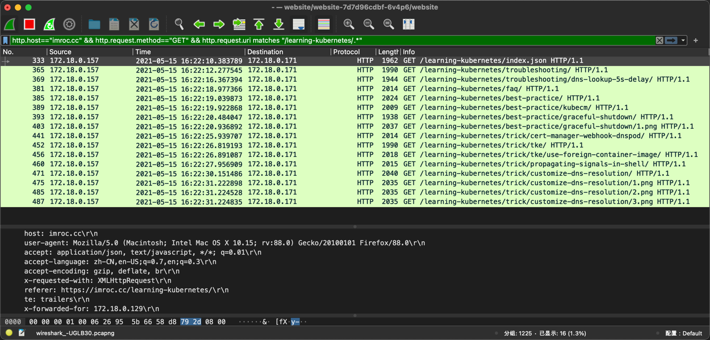
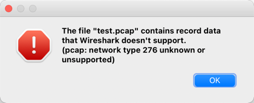

# 使用 ksniff 远程抓包

## 概述

Kubernetes 环境中遇到网络问题需要抓包排查怎么办？传统做法是登录 Pod 所在节点，然后 [使用 nsenter 进入 Pod netns 抓包](nsenter.md)，最后使用节点上 tcpdump 工具进行抓包。整个过程比较繁琐，好在社区出现了 [ksniff](https://github.com/eldadru/ksniff) 这个小工具，它是一个 kubectl 插件，可以让我们在 Kubernetes 中抓包变得更简单快捷。

本文将介绍如何使用 ksniff 这个工具来对 Pod 进行抓包。

## 安装

ksniff 一般使用 [krew](https://github.com/kubernetes-sigs/krew) 这个 kubectl 包管理器进行安装:

```bash
kubectl krew install sniff
```
## 使用 wireshark 实时分析

抓取指定 Pod 所有网卡数据包，自动弹出本地安装的 wireshark 并实时捕获:

```bash
kubectl -n test sniff website-7d7d96cdbf-6v4p6
```

可以使用 wireshark 的过滤器实时过滤分析哟:



## 保存抓包文件

有时在生产环境我们可能无法直接在本地执行 kubectl，需要经过跳板机，这个时候我们可以将抓到的包保存成文件，然后再拷到本地使用 wireshark 分析。

只需加一个 `-o` 参数指定下保存的文件路径即可:

```bash
kubectl -n test sniff website-7d7d96cdbf-6v4p6 -o test.pcap
```

## 特权模式

ksniff 默认通过上传 tcpdump 二进制文件到目标 Pod 的一个容器里，然后执行二进制来实现抓包。但该方式依赖容器是以 root 用户启动的，如果不是就无法抓包。

这个时候我们可以加一个 `-p` 参数，表示会在 Pod 所在节点新起一个 privileged 的 Pod，然后该 Pod 会调用容器运行时 (dockerd 或 containerd 等)，新起一个以 root 身份启动的 container，并 attach 到目标 Pod 的 netns，然后执行 container 中的 tcpdump 二进制来实现抓包。

用法示例:

```bash
kubectl -n test sniff website-7d7d96cdbf-6v4p6 -p
```

## 查看明文

如果数据包内容很多都是明文 (比如 HTTP)，只希望大概看下明文内容，可以指定 `-o -` 将抓包内容直接打印到标准输出 (stdout):

```bash
kubectl -n test sniff website-7d7d96cdbf-6v4p6 -o -
```
## 抓取时过滤

有时数据量很大，如果在抓取时不过滤，可能会对 apiserver 造成较大压力 (数据传输经过 apiserver)，这种情况我们最好在抓取时就指定 tcpdump 过滤条件，屏蔽掉不需要的数据，避免数据量过大。

加 `-f` 参数即可指定过滤条件，示例:

```bash
kubectl -n test sniff website-7d7d96cdbf-6v4p6 -f "port 80"
```

## FAQ

### wireshark 报 unknown

打开抓包文件时，报错 `pcap: network type 276 unknown or unsupported`:



通常是因为 wireshark 版本低导致的，升级到最新版就行。

### 抓包时报 No such file or directory

使用 kubectl sniff 抓包时，报错 `ls: cannot access '/tmp/static-tcpdump': No such file or directory` 然后退出:


这是笔者在 mac 上安装当时最新的 ksniff v1.6.0 版本遇到的问题。该问题明显是一个 bug，static-tcpdump 二进制没有上传成功就去执行导致的，考虑三种解决方案:

1. 手动使用 kubectl cp 将二进制拷到目标 Pod 再执行 kubectl sniff 抓包。
2. kubectl sniff 指定 `-p` 参数使用特权模式 (亲测有效)。
3. 编译最新的 ksniff，替换当前 kubectl-sniff 二进制，这也是笔者目前的使用方式。